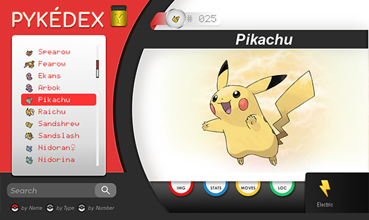
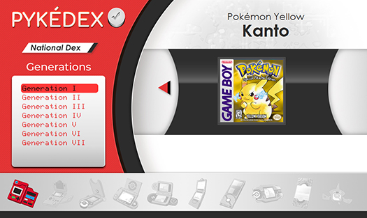
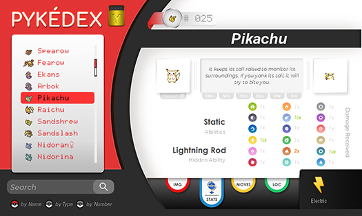

###Pokédex with Python

Desktop application made with [Python](https://www.python.org/), 
[PyQt5](https://www.riverbankcomputing.com/software/pyqt/intro) and 
[SQLite](https://www.sqlite.org/index.html).

[PyInstaller](https://www.pyinstaller.org/) is also used to compile the python scripts into a Windows 
executable, you can use the program without the need to install Python on your machine. Other systems aren't supported right now, 
I'm affraid you'll will have to install Python if you're on Linux or Mac.

### Sources

Database by [Veekun](https://github.com/veekun/pokedex).
It is currently updated up until Ultra Sun and Ultra Moon versions.

Additional sources of information like [Bulbapedia](https://bulbapedia.bulbagarden.net/wiki/Main_Page) or 
[Serebii](https://www.serebii.net/) are planned for the future. 
[Scrapy](https://scrapy.org/) will be used for the scraping process, 
and the current database tables will be updated accordingly.

Pokémon images are downloaded from [Bulbapedia](https://bulbapedia.bulbagarden.net/wiki/Main_Page).

Pokémon sprites for Generation I to Generation V are also provided by [Veekun](https://veekun.com/dex/downloads). 
For Gen VI and later I've used the ones available at 
[Smogon's](https://www.smogon.com/forums/forums/smeargles-laptop.325/) 
forums, created by the very talented spriters that share their work there.

### What's the point?

Instead of using an api like [PokéAPI](https://pokeapi.co/). 
By powering the application with an offline database you don't need an internet connection to use it. 
All images and text based information are included in the build. 
That approach will always be one of the major key aspects of this project's design.

This is mainly just a learning project and should be perceived as such. 
Even though the program is constantly debugged during development, 
bugs might occur. If you feel like the code could be improved please let me know, 
there is always room for some refactoring.

### Disclaimer
Pokémon and Pokémon character names are Trademark & © of Nintendo.

© 2019 Pokémon. © 1995–2019 Nintendo/Creatures Inc./GAME FREAK inc.

